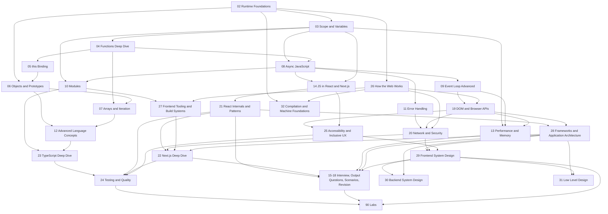

# Roadmap

This roadmap tells you what to study, why the order matters, how to prove each section is learned, and when to move from learning to interview practice.

The path is designed around one idea: JavaScript knowledge compounds. Closures depend on lexical environments. `this` depends on call form and receiver. async/await depends on promises. event-loop reasoning depends on ECMAScript jobs plus host tasks and microtasks. React hook bugs depend on closures, identity, async ordering, and render snapshots.

## Source Anchors

Use this roadmap with the source hierarchy from [[00 - Start Here|Start Here]]:

- [ECMAScript specification](https://tc39.es/ecma262/) for language semantics and official terms.
- [MDN JavaScript](https://developer.mozilla.org/en-US/docs/Web/JavaScript) and Web API docs for developer-facing language and browser API guidance.
- [HTML Living Standard](https://html.spec.whatwg.org/multipage/webappapis.html) for browser event-loop scheduling.
- [React docs](https://react.dev/reference/react) for rendering, state, effects, memoization, and hooks.
- [Next.js docs](https://nextjs.org/docs) for server/client boundaries, routing, rendering, and hydration.
- [web.dev](https://web.dev/) for performance, loading, responsiveness, and measurement.

The roadmap is not a replacement for sources. It is the order and practice system that tells you when to use them.

## Priority Labels

| Label      | Meaning                                       | How to treat it                                   |
| ---------- | --------------------------------------------- | ------------------------------------------------- |
| #must-know | Common in interviews and daily frontend work. | Learn deeply, drill, and revisit often.           |
| #important | Strong signal of JavaScript fluency.          | Learn well enough to explain tradeoffs.           |
| #deep-dive | Less common but senior-leaning.               | Use for production maturity and standout answers. |

## Dependency Map

| Foundation                        | Unlocks                                                    |
| --------------------------------- | ---------------------------------------------------------- |
| Execution context and call stack  | scope, hoisting, closures, `this`, errors                  |
| Lexical environments and bindings | closures, stale closures, modules, dependency arrays       |
| Functions and call forms          | callbacks, debounce/throttle, `this`, classes              |
| Objects and identity              | prototypes, copying, React memoization, state immutability |
| Promises and jobs                 | async/await, event loop, API errors, React async effects   |
| Host event loop                   | timers, rendering, UI responsiveness, race conditions      |
| React render model                | hooks, dependency arrays, referential equality, hydration  |

When stuck, move backward to the prerequisite. Do not brute-force advanced topics with missing foundations.

## Dependency Graph

## Why This Order Matters

The roadmap starts with runtime foundations because runtime vocabulary prevents vague explanations later:

- Execution context explains why hoisting, TDZ, closures, `this`, and stack traces exist.
- Lexical environments explain why closures and React stale closures are the same category of problem.
- Functions and call forms explain callbacks, debounce/throttle, class methods, and `this`.
- Objects and identity explain prototypes, shallow copies, React state, memoization, and dependency arrays.
- Promises and jobs explain async/await, API state, event-loop output, and race conditions.
- Host event loops explain why CPU-heavy work blocks paint and why microtasks can starve rendering.

If a later topic feels slippery, the answer is usually not "read harder." It is "find the prerequisite that owns the mechanism."

## Full Learning Path

| Phase | Module | Priority | Outcome | Dependencies |
| ----- | ------ | -------- | ------- | ------------ |
| 0 | [[00 - Start Here\|Start Here]] | #must-know | Know how to study the vault and verify source-backed learning. | None |
| 1 | [[02 - JavaScript Runtime Foundations/01 - ECMAScript vs JavaScript\|Runtime Foundations]] | #must-know | Separate language, engine, runtime, host APIs, stack, heap, realms, and jobs. | Start Here |
| 2 | [[03 - Scope and Variables/01 - Scope Types\|Scope and Variables]] | #must-know | Explain bindings, lexical environments, hoisting, TDZ, closures, and closure bugs. | Runtime Foundations |
| 3 | [[04 - Functions Deep Dive/01 - Function Declarations vs Expressions\|Functions Deep Dive]] | #must-know | Understand functions as values, callbacks, purity, parameters, currying, debounce, and throttle. | Scope and Variables |
| 4 | [[05 - this Binding/01 - What is this\|this Binding]] | #must-know | Explain receiver binding, strict mode, arrows, bind/call/apply, constructors, and React class examples. | Functions |
| 5 | [[06 - Objects and Prototypes/01 - Objects Internally\|Objects and Prototypes]] | #important | Explain descriptors, prototypes, constructors, classes, copying, and identity. | Runtime + this |
| 6 | [[07 - Arrays and Iteration/01 - Array Internals\|Arrays and Iteration]] | #must-know | Transform UI data safely while avoiding mutation and avoidable render cost. | Functions + Objects |
| 7 | [[08 - Async JavaScript/01 - Sync vs Async JavaScript\|Async JavaScript]] | #must-know | Model promises, async/await, errors, cancellation, API integration, and stale results. | Closures + Functions |
| 8 | [[09 - Event Loop Advanced/01 - Event Loop Overview\|Event Loop Advanced]] | #must-know | Trace tasks, microtasks, promise jobs, timers, animation frames, rendering responsiveness, and Node vs browser loops. | Async JavaScript |
| 9 | [[19 - DOM and Browser APIs/01 - DOM Fundamentals and the Render Pipeline\|DOM and Browser APIs]] | #must-know | Render pipeline, event propagation/delegation, storage, observers, fetch, forms, workers, service workers, history. | Event Loop |
| 9b | [[26 - How the Web Works/01 - From URL to Pixels\|How the Web Works]] | #must-know | Narrate URL-to-pixels: DNS, connections/HTTP versions, browser processes, engines, V8 pipeline, HTML/CSS/JS loading model. | Runtime Foundations + Event Loop |
| 10 | [[10 - Modules/01 - ES Modules\|Modules]] | #important | Understand ESM, CommonJS, exports, dynamic imports, live bindings, cycles, bundle behavior, and source-to-browser tooling. | Scope + Async |
| 10b | [[27 - Frontend Tooling and Build Systems/01 - Why Build Tools Exist\|Frontend Tooling and Build Systems]] | #important | Explain why build tools exist, transpilation (Babel/SWC/esbuild), Webpack and Vite mental models, and production build outputs. | Modules + How the Web Works |
| 11 | [[11 - Error Handling/01 - try catch throw finally\|Error Handling]] | #important | Model sync errors, async rejections, custom errors, API failures, and React error boundaries. | Async + React basics |
| 12 | [[20 - Network and Security/01 - HTTP Essentials for Frontend\|Network and Security]] | #must-know | HTTP, caching, CORS, cookies/auth, XSS, CSRF/CSP, prototype pollution, supply chain, realtime transports. | Error Handling + DOM/APIs |
| 13 | [[12 - Advanced Language Concepts/01 - Primitive vs Reference Values\|Advanced Language Concepts]] | #important | Master equality, coercion, truthiness, destructuring, symbols, iterators, collections, BigInt/Date/JSON, numbers, strings/Unicode, typed arrays, Proxy, Intl. | Objects + Arrays |
| 14 | [[13 - Performance and Memory/01 - Memory Management\|Performance and Memory]] | #deep-dive | Diagnose reachability, leaks, retained closures, cleanup, memoization, React performance, DevTools profiling, and Core Web Vitals. | Closures + Event Loop |
| 15 | [[14 - JavaScript in React and Next.js/01 - JavaScript Fundamentals in React\|JavaScript in React and Next.js]] | #must-know | Apply JavaScript semantics to hooks, effects, identity, immutability, async effects, server/client code, and hydration. | All prior foundations |
| 16 | [[21 - React Internals and Patterns/01 - Render and Commit Phases\|React Internals and Patterns]] | #must-know | Render/commit, reconciliation/keys, Fiber, batching, context, refs, effect timing, external stores, Suspense, React 19, hooks, controlled/uncontrolled. | JS in React |
| 16b | [[28 - Frameworks and Application Architecture/01 - The Problem Frameworks Solve\|Frameworks and Application Architecture]] | #must-know | Derive frameworks from the state-sync problem; Web Components; update models compared; meta-frameworks; state taxonomy; server state; compound components; FSD/Clean/Atomic. | React Internals + DOM/Browser APIs |
| 17 | [[22 - Next.js Deep Dive/01 - Rendering Strategies\|Next.js Deep Dive]] | #must-know | Rendering strategies, the caching layers, revalidation, server actions, route handlers/proxy, data fetching, metadata/SEO, asset optimization. | React Internals |
| 18 | [[23 - TypeScript Deep Dive/01 - Type System Mental Model\|TypeScript Deep Dive]] | #must-know | Model real constraints with types: inference, narrowing, generics, variance, runtime validation at untrusted boundaries, tsconfig, React/Next typing. | Modules + Advanced Language Concepts |
| 19 | [[24 - Testing and Quality/01 - Testing Mental Model\|Testing and Quality]] | #must-know | Choose the cheapest reliable failure detector: unit, component-through-behavior, MSW, deterministic async tests, Playwright, Next boundaries, CI gates. | TypeScript + React Internals + Next.js |
| 20 | [[25 - Accessibility and Inclusive UX/01 - Semantic HTML Before ARIA\|Accessibility and Inclusive UX]] | #must-know | Ship semantics, keyboard/focus, accessible forms and async states, correct ARIA, dialogs, announcements — verified by automated floors plus manual passes. | DOM/Browser APIs + JS in React |
| 21 | [[15 - Interview Preparation/01 - Junior to Mid Questions\|Interview Preparation]] | #must-know | Convert knowledge into clear, calm, experienced technical communication. | All core modules |
| 21b | [[29 - Frontend System Design/01 - The Frontend System Design Framework\|Frontend System Design]] | #must-know | Run RADIO on any "design X" prompt: requirements, architecture, data model, component + network APIs, ranked optimizations — with tradeoffs, in 35 minutes. | Frameworks + Scenarios + Network + a11y |
| 21c | [[30 - Backend System Design/00 - Backend System Design MOC\|Backend System Design]] | #important | Only if your loop has a general/backend system-design round. Networking, API design, data modeling, caching, sharding & consistent hashing, CAP/PACELC, quorum, indexing, the seven access patterns — each tied to its frontend mirror. | Frontend System Design + Frameworks |
| 21d | [[31 - Low Level Design/00 - Low Level Design MOC\|Low Level Design]] | #important | Only if your loop has an OOP/LLD/machine-coding round. SOLID, OOP, design patterns, and concurrency foundations in TypeScript — each with its frontend mirror. | Frameworks + TypeScript |
| 21e | [[32 - Compilation and Machine Foundations/12 - Compiled vs Interpreted and Every Stage Between\|Compilation and Machine Foundations]] | #deep-dive | Off the interview path — but note 12 ("is JavaScript compiled or interpreted?", all ten stages, bundler-as-linker) is the one part that does come up in interviews. Then the machine layer under module 02: bytecode to machine code, stack vs register encodings, LLVM, AOT vs JIT, reflection vs compile-time codegen, the CPU and the memory hierarchy. Read for curiosity and for the build-time-vs-runtime intuition it transfers — never instead of the modules above. Its build companion is [[90 - Labs/07 - Bytecode VM Lab\|Lab 07]] (6-10 hours, also off-path). | Runtime Foundations + How the Web Works |
| 22 | [[16 - Code Output Questions/01 - Scope and Hoisting Output Questions\|Code Output Questions]] | #must-know | Trace execution before touching the keyboard. | Continuous |
| 23 | [[17 - Practical Frontend Scenarios/01 - Fixing Stale Closure in React\|Practical Frontend Scenarios]] | #must-know | Solve real UI bugs with production-ready patterns and tradeoffs. | Continuous |
| 24 | [[90 - Labs/00 - Labs MOC\|Labs]] | #important | Build the mechanisms: profiler, typed boundary, accessible search, cached mutation — with tests and a11y passes. | Modules 22–25 as per lab |
| 25 | [[18 - Revision Plans/01 - Complete Advanced JavaScript Checklist\|Revision Plans]] | #important | Use spaced repetition, checklists, and timed interview drills. | Continuous |
| 26 | [[99 - Glossary\|Glossary]] | #important | Use precise terms naturally without overloading answers. | Continuous |

## Module Outcomes

Sections below follow the study order of the Full Learning Path table above; each heading names its vault module number.

### Module 00 — Start Here

You should understand the learning contract, source hierarchy, and study loop. The production habit is to connect every concept to a real bug or implementation decision.

Interview signal: you can explain how you study, verify, and practice rather than saying you "read docs."

Prerequisite check:

- Can you name the source of truth for language, browser, React, Next.js, and performance behavior?
- Can you explain why a code-output question should be predicted before running?

Show answer

Source of truth: ECMAScript for language semantics, HTML/browser specs for event-loop and platform integration, MDN for practical Web API and JavaScript explanations, React docs for rendering/effects/hooks, Next.js docs for server/client boundaries, and web.dev for performance measurement. Code-output questions should be predicted first because the skill is execution tracing, not recognizing an answer after the runtime has already told you.

### Module 02 — Runtime Foundations

Learn to separate ECMAScript from JavaScript-in-a-host. You should be able to explain what the engine does, what the runtime provides, why the stack matters, and why host APIs such as timers and DOM are not core language features.

Production signal: you can debug whether a problem belongs to language semantics, browser APIs, framework scheduling, or application state.

Interview signal: you can answer "what happens when JavaScript runs this file?" with stack, heap, execution context, host APIs, and queue terminology without overclaiming.

Hard edge cases to master:

- `setTimeout` is host behavior, not ECMAScript.
- Promise reactions are ECMAScript jobs integrated into browser microtask checkpoints.
- Workers are separate execution units with messaging costs and require COOP/COEP headers to use `SharedArrayBuffer`.
- Cross-realm values can break constructor-based checks such as `instanceof Array`.
- `globalThis` acts as an environment-agnostic accessor to avoid Next.js SSR ReferenceErrors.
- V8 optimizations like Hidden Classes (Shapes) and array Element Kinds (Packed vs. Holey) dictate heap layout performance.
- `WeakRef` and `FinalizationRegistry` (ES2021) manage memory-safe caches without preventing Garbage Collection.

### Module 03 — Scope and Variables

Learn lexical environments, environment records, declaration instantiation, TDZ, and closure lifetime. This is the base for hooks, modules, stale callbacks, and many code-output questions.

Production signal: you can identify which render or function call created the binding a callback is reading.

Interview signal: you can explain hoisting without saying declarations move, and you can connect closures to retained bindings.

### Module 04 — Functions Deep Dive

Learn functions as objects and values: declarations, expressions, arrows, callbacks, purity, parameters, currying, debounce, and throttle.

Production signal: you can design callbacks that preserve arguments, cleanup, cancellation, `this` behavior, and stable identity when needed.

Interview signal: you can choose a function form based on semantics: hoisting, `this`, constructor ability, `arguments`, identity, and readability.

### Module 05 — this Binding

Learn `this` from call form, not from where a function is written. Ordinary calls, method calls, bound functions, constructors, class methods, and arrows each have different behavior.

Production signal: you can explain why extracted methods break and why arrows fix some callback cases but are wrong for dynamic receivers.

Interview signal: you can inspect the call expression and identify default, implicit, explicit, constructor, or lexical binding.

### Module 06 — Objects and Prototypes

Learn object internals, property descriptors, prototype lookup, constructors, classes, and copying.

Production signal: you can avoid shallow-copy bugs, prototype confusion, accidental mutation, descriptor surprises, and inheritance overuse.

Interview signal: you can describe `new` step by step and separate a constructor's `.prototype` from an instance's internal prototype link.

### Module 07 — Arrays and Iteration

Learn dense vs sparse arrays, mutation, immutable methods, transformation methods, search methods, sorting, and iterable protocols.

Production signal: you can transform API data into UI-ready data without mutating state or doing expensive work on every render.

Interview signal: you can choose `map`, `filter`, `reduce`, `for...of`, `some`, `every`, or `find` by intent, not habit.

### Module 08 — Async JavaScript

Learn promises, promise combinators, async/await, async error handling, AbortController, and API integration boundaries.

Production signal: you can prevent duplicate requests, stale writes, unhandled rejections, stuck loading states, and inconsistent API error handling.

Interview signal: you can compare `Promise.all`, `allSettled`, `race`, and `any` by failure semantics and UX.

### Module 09 — Event Loop Advanced

Learn tasks, microtasks, promise jobs, timers, queueMicrotask, requestAnimationFrame, and rendering opportunities.

Production signal: you can explain why UI freezes, why promises run before timers, why microtask loops are dangerous, and how to yield work.

Interview signal: you can trace sync code, promise callbacks, queued microtasks, timers, and paint opportunities in order.

### Module 19 — DOM and Browser APIs

Learn the browser platform layered on top of the language: the DOM and render pipeline, event propagation and delegation, storage, the observer APIs, fetch and forms, workers and service workers, and history/navigation.

Production signal: you pick the right primitive for the job — delegation over per-node listeners, an observer over a scroll handler, a worker over a blocked main thread — and can name the render-pipeline cost of a given DOM change.

Interview signal: you can trace an event through capture, target, and bubble phases, explain why layout thrash happens, and describe how to batch reads and writes.

### Module 26 — How the Web Works

Learn the platform from the ground up: DNS and domains, TCP/TLS/QUIC and HTTP versions, the browser's multi-process architecture, rendering vs JS engines, V8's adaptive pipeline, and the HTML/CSS/JS loading model.

Production signal: given "the site is slow," you name the pipeline stage — DNS, TTFB, render-blocking resources, or main-thread work — before proposing a fix.

Interview signal: you can answer "what happens when you type a URL?" at any depth the interviewer picks, and separate Blink/WebKit/Gecko from V8/JSC/SpiderMonkey without mixing the lists.

### Module 10 — Modules

Learn ESM vs CommonJS, static vs dynamic imports, named vs default exports, live bindings, circular dependencies, tree shaking, and code splitting.

Production signal: you can reason about bundle size, lazy loading, top-level side effects, server/client safety, and circular import failures.

Interview signal: you can explain live bindings and why circular imports can fail before initialization.

### Module 27 — Frontend Tooling and Build Systems

Learn the machinery between source and browser: the problem chain that created build tools, transpilation vs polyfills vs type checking, Webpack's graph/loaders/plugins/chunks, Vite's native-ESM dev server and Rollup production builds, and what a production build emits.

Production signal: build failures and works-in-dev-breaks-in-build bugs are debuggable by layer; caching headers, source maps, and env vars in your deploys are deliberate.

Interview signal: you can answer "why is Vite fast?" with architecture (no dev bundling) rather than "it uses esbuild," and explain why we still bundle despite native ESM.

### Module 11 — Error Handling

Learn try/catch/finally, Error objects, custom errors, promise rejections, React error boundaries, and API error patterns.

Production signal: you can separate expected user-facing failures from programmer bugs and build recovery paths without hiding important failures.

Interview signal: you can explain what `try/catch` catches, what it does not catch, and how error boundaries fit into React UI containment.

### Module 20 — Network and Security

Learn the network and security surface a frontend owns: HTTP and caching, CORS, cookies and auth, XSS, CSRF and CSP, prototype pollution, supply-chain risk, and realtime transports.

Production signal: you set caching and CORS deliberately, store and send credentials safely, and treat every untrusted string as a potential injection until it is encoded or sanitized.

Interview signal: you can explain the browser's same-origin model, why CORS exists, and the concrete mechanism behind an XSS or CSRF attack and its defense.

### Module 12 — Advanced Language Concepts

Learn primitive/reference values, equality, Object.is, coercion, truthiness, optional chaining, destructuring, symbols, iterators, maps, sets, WeakMap, Date, RegExp, JSON, and BigInt.

Production signal: you can normalize API boundaries, validate forms correctly, build stable cache keys, and avoid serialization surprises.

Interview signal: you can explain equality and coercion with mechanisms, then recommend simpler production patterns.

### Module 13 — Performance and Memory

Learn reachability, garbage collection, memory leaks, closures retaining memory, cleanup, memoization, React render cost, and Chrome DevTools memory profiling.

Production signal: you measure first, find retaining paths, distinguish calculation cost from render cost, and avoid cargo-cult memoization.

Interview signal: you can name the bottleneck category before naming the fix: CPU, memory, network, rendering, bundle, or framework rerendering.

### Module 14 — JavaScript in React and Next.js

Learn how ordinary JavaScript behavior appears through React rendering and Next.js execution environments.

Production signal: you can explain stale closures, dependency arrays, referential equality, immutable updates, async effects, AbortController cleanup, server/client boundaries, and hydration mismatches.

Interview signal: you can avoid folklore and say which JavaScript mechanism, React rule, or Next.js boundary caused the bug.

### Module 21 — React Internals and Patterns

Learn how React works beneath the API: render and commit phases, reconciliation and keys, Fiber, batching, context and refs, effect timing, external stores, Suspense, the React 19 additions, and the hook rules that fall out of the model.

Production signal: you can explain why a component re-rendered, place effects with correct timing and cleanup, and choose controlled vs uncontrolled and context vs external store on mechanism, not habit.

Interview signal: you can walk render → reconcile → commit, explain why keys matter and what batching changes, and connect a hook rule back to the closure or identity that causes it.

### Module 28 — Frameworks and Application Architecture

Learn the why-layer above React: the M×N state-sync problem frameworks solve, Web Components fairly assessed, VDOM vs signals vs compilers, meta-frameworks by philosophy, the state taxonomy (local/lifted/shared/global/server/URL), server state as a cache, compound components, and FSD/Clean/Atomic with their costs.

Production signal: state lives at the narrowest sufficient scope, server data lives in a query cache, shared components stop accumulating boolean props, and folder structure encodes dependency rules.

Interview signal: you can answer "why React over vanilla JS?", "how do you manage state?", and "how would you structure a large app?" with mechanisms and tradeoffs, not tool names.

### Module 22 — Next.js Deep Dive

Learn Next.js as a system of boundaries and caches: the rendering strategies, the caching layers and revalidation, server actions, route handlers as a proxy, data fetching, metadata and SEO, and asset optimization.

Production signal: you know which cache served a stale response and how to revalidate it, and you keep server-only code and secrets on the correct side of the server/client boundary.

Interview signal: you can compare the rendering strategies by tradeoff, explain what runs on the server vs the client, and describe how the caching layers interact.

### Module 23 — TypeScript Deep Dive

Learn TypeScript as static analysis over JavaScript: structural typing, erasure, inference and widening, narrowing and discriminated unions, generics with restraint, variance, and the boundary discipline — `unknown` plus runtime validation wherever data enters the program.

Production signal: invalid states become unrepresentable, and no network/storage/action input reaches typed code without one validated parse.

Interview signal: you can explain why types don't validate runtime input, and what `satisfies`, `as const`, and an annotation each do differently.

### Module 24 — Testing and Quality

Learn tests as failure detectors judged by confidence, cost, and signal: unit tests from hazard analysis, component tests through user behavior, MSW at the network seam, fake timers and forced interleavings for races, a small trusted E2E layer, direct-invocation tests for Server Actions, and CI gates.

Production signal: the race conditions, cancellation bugs, and cache staleness taught in modules 08/14/17/22 are pinned by deterministic tests.

Interview signal: given a feature, you allocate failure classes to the cheapest reliable layer instead of reciting a coverage ritual.

### Module 25 — Accessibility and Inclusive UX

Learn semantics-first accessibility: native elements before ARIA, keyboard and focus as core mechanics, forms whose errors are associated and announced, correct dialogs via platform primitives, live regions for async UI, and the numbers (contrast, zoom/reflow) — verified by automated floors plus manual keyboard/screen-reader passes.

Production signal: your features are completable eyes-free and mouse-free, and manual findings become regression tests.

Interview signal: you can state what axe can and cannot catch, and fix an inaccessible dialog or async form from mechanism, not memory.

### Module 15 — Interview Preparation

Train answer structure, bad-vs-good answers, strong mid-level explanations, senior-style thinking, and mock interview delivery.

Production signal: your answer includes a mechanism, an example, and a tradeoff without sounding scripted.

### Module 29 — Frontend System Design

**When to study:** if your loop has any frontend design round — common at product companies for mid-to-senior roles.

Learn the design-round format: RADIO as the repeatable structure, the controller/query-layer split, server state vs UI state in widget form, component APIs with inversion of control, cacheable network APIs, and optimizations ranked by requirement — walked end to end on the canonical Autocomplete question.

Production signal: design docs and reviews open with requirements and tradeoffs; state ownership boundaries are drawn before code exists.

Interview signal: given "design an autocomplete/feed/carousel," you run a structured 35-minute pass covering races, caching, a11y, and failure states unprompted.

### Module 30 — Backend System Design

**When to study:** only if your loop has a general or backend system-design round. Otherwise skim the frontend-mirror callouts and move on — it's a conditional track, not part of the core spine.

Understand the box the frontend treats as a black box: the delivery framework (the backend cousin of RADIO), protocol choice, API design and pagination, data modeling, caching, sharding and consistent hashing, CAP/consistency, indexing, current hardware numbers, the seven access patterns, and the core technologies. Every note ties back to its frontend mirror — caching, contention, real-time transport, and consistency are your client knowledge one scale up.

Production signal: you can reason about why an API is shaped or eventually-consistent the way it is, and talk to backend teammates in mechanisms and tradeoffs.

Interview signal: you can run a structured backend "design X" pass, choose stores and caching deliberately, and reject premature sharding with current numbers.

### Module 31 — Low Level Design

**When to study:** only if your loop has an OOP/LLD/machine-coding round. A conditional track, smaller than the others.

The OOP/design-quality round: the class-design delivery framework, SOLID and the general principles, the four OOP pillars with composition over inheritance, the five design patterns that matter, and concurrency foundations — with the JS-specific twist that the single-threaded event loop changes the toolkit (async locks for `await`-spanning critical sections, `navigator.locks`, and Web Workers + message passing), without meaning mutual exclusion is never needed.

Production signal: you design a feature's types and boundaries before methods, and reach for a pattern only when the problem calls for it.

Interview signal: you derive clean classes from requirements, argue composition vs inheritance concretely, and connect each pattern to where it already lives in your frontend code.

### Module 16 — Code Output Questions

Trace scope, closures, `this`, prototypes, async ordering, and mixed questions.

Production signal: you can debug by execution order instead of trying random fixes.

### Module 17 — Practical Frontend Scenarios

Practice real situations: stale closures, duplicate requests, races, large list transformations, mutation, listener cleanup, form submission, memory leaks, debounced search, and request cancellation.

Production signal: you can move from symptom to root cause to safe implementation.

### Module 90 — Labs

Apply everything: the [[90 - Labs/00 - Labs MOC|labs]] force the event loop, typed boundaries, accessible async flows, and Next caching through your own fingers, with planted bugs to diagnose — plus a code-review lab where you're the reviewer, and a timed frontend system-design round to rehearse the design interview out loud.

### Module 18 — Revision Plans

Use checklists, 7-day plans, 14-day plans, interview questions, output drills, and practical scenario repetition.

Production signal: you can keep knowledge available under pressure instead of relearning topics from zero.

### Module 99 — Glossary

Use precise terms like execution context, lexical environment, environment record, reference record, promise job, task, microtask, realm, and reachability.

Production signal: you can use one precise term when it clarifies the answer, without hiding behind jargon.

## Recommended Paths

### Full Path: 6-8 Weeks

Use this when you are building durable mastery:

1. Work the Full Learning Path table top to bottom (phase 0 → Glossary), including the lettered inserts (9b, 10b, 16b, 21b–21d). Modules 30 and 31 (21c/21d) are optional — study them only if your loop has a system-design or LLD round.
2. Do code-output questions three times per week.
3. Do one practical frontend scenario after every two concept modules.
4. Review the glossary weekly.
5. Use interview prep only after the concept has a real mechanism behind it.

### Interview Fast Track: 7-10 Days

Use this when an interview is close:

1. [[03 - Scope and Variables/05 - Closures|Closures]]
2. [[03 - Scope and Variables/04 - Hoisting and TDZ|Hoisting and TDZ]]
3. [[05 - this Binding/01 - What is this|this]]
4. [[08 - Async JavaScript/02 - Promises|Promises]]
5. [[08 - Async JavaScript/04 - Async Await|Async Await]]
6. [[09 - Event Loop Advanced/02 - Tasks vs Microtasks|Tasks vs Microtasks]]
7. [[14 - JavaScript in React and Next.js/03 - Stale Closures|Stale Closures]]
8. [[14 - JavaScript in React and Next.js/04 - Dependency Arrays|Dependency Arrays]]
9. [[17 - Practical Frontend Scenarios/02 - Preventing Duplicate API Requests|Preventing Duplicate API Requests]]
10. [[16 - Code Output Questions/06 - Mixed Advanced Output Questions|Mixed Advanced Output Questions]]

Then, only if your loop includes the matching round:

11. [[29 - Frontend System Design/01 - The Frontend System Design Framework|Frontend System Design: RADIO]] (frontend design round)
12. [[30 - Backend System Design/05 - Caching|Backend System Design: Caching]] (general system-design round)
13. [[31 - Low Level Design/04 - Design Patterns|Low Level Design: Design Patterns]] (OOP/LLD round)

### System Design & LLD Track

Use this when your loop is design- or OOP-heavy (in addition to the fundamentals above):

1. [[29 - Frontend System Design/01 - The Frontend System Design Framework|The Frontend System Design Framework (RADIO)]]
2. [[29 - Frontend System Design/03 - Frontend System Design Checklist|Frontend System Design Checklist]]
3. Worked walkthroughs: [[29 - Frontend System Design/02 - Designing an Autocomplete|Autocomplete]], [[29 - Frontend System Design/04 - Designing an Infinite Scroll Feed|Infinite Scroll Feed]], [[29 - Frontend System Design/17 - Designing a Data Table|Data Table]], [[29 - Frontend System Design/19 - Designing a Chat and Messaging App|Chat]]
4. Rehearse under time: [[90 - Labs/06 - Frontend System Design Round Lab|Frontend System Design Round Lab]]
5. Backend (if a general SD round): [[30 - Backend System Design/00 - Backend System Design MOC|Backend System Design MOC]] → [[30 - Backend System Design/05 - Caching|Caching]], [[30 - Backend System Design/07 - CAP and Consistency|CAP and Consistency]]
6. LLD (if an OOP round): [[31 - Low Level Design/02 - Design Principles|Design Principles]], [[31 - Low Level Design/04 - Design Patterns|Design Patterns]]

### Production Debugging Track

Use this when your goal is stronger real-world judgment:

1. [[08 - Async JavaScript/07 - API Integration Examples|API Integration Examples]]
2. [[17 - Practical Frontend Scenarios/03 - Handling Race Conditions|Handling Race Conditions]]
3. [[17 - Practical Frontend Scenarios/10 - Request Cancellation|Request Cancellation]]
4. [[13 - Performance and Memory/03 - Memory Leaks|Memory Leaks]]
5. [[13 - Performance and Memory/08 - Chrome DevTools Memory Profiling|Chrome DevTools Memory Profiling]]
6. [[14 - JavaScript in React and Next.js/07 - Async Effects and Race Conditions|Async Effects and Race Conditions]]
7. [[14 - JavaScript in React and Next.js/10 - Hydration Related JavaScript Issues|Hydration Related JavaScript Issues]]

### Runtime Foundations Fast Track: 1 Day

Use this if modules 00-02 are the current focus:

1. Read [[00 - Start Here|Start Here]] and write the study contract in your own words.
2. Read [[01 - Roadmap|Roadmap]] and identify the prerequisite behind your weakest topic.
3. Study [[02 - JavaScript Runtime Foundations/01 - ECMAScript vs JavaScript|ECMAScript vs JavaScript]] and classify 10 APIs by layer.
4. Study [[02 - JavaScript Runtime Foundations/02 - JavaScript Engine and Runtime|JavaScript Engine and Runtime]] and explain parse/compile/runtime/rendering cost.
5. Study [[02 - JavaScript Runtime Foundations/03 - Execution Context|Execution Context]] and trace hoisting plus `await`.
6. Study [[02 - JavaScript Runtime Foundations/04 - Call Stack|Call Stack]] and rewrite one recursive example iteratively.
7. Study [[02 - JavaScript Runtime Foundations/05 - Memory Heap|Memory Heap]] and identify a retaining path, WeakRef cleanup, and V8 array element kinds.
8. Study [[02 - JavaScript Runtime Foundations/06 - Realm Agent and Job Queue|Realm Agent and Job Queue]] and trace cross-realm behavior, workers, and SharedArrayBuffer security context.
9. Finish with [[02 - JavaScript Runtime Foundations/07 - Runtime Foundations Checklist|Runtime Foundations Checklist]].

Done means you can explain why a browser UI can freeze, why a promise callback does not run immediately, why `window` fails on the server, why a worker helps CPU work, why a value from an iframe can fail `instanceof`, why `SharedArrayBuffer` throws in production, how V8's array element kinds and block-scoping scopes behave, and when to use `WeakRef` caches.

## How To Know A Module Is Complete

A module is complete when you can:

- Give a simple definition for every main topic.
- Name the accurate mechanism without overusing jargon.
- Trace at least one code example from the module.
- Explain a production bug caused by misunderstanding the topic.
- Write or describe the production-safe fix.
- Answer one interview question in 30 seconds and one follow-up in 2 minutes.
- Connect the module to at least one later module.

## Weekly Cadence

| Day       | Practice                                                 |
| --------- | -------------------------------------------------------- |
| Monday    | One concept note plus one written summary.               |
| Tuesday   | One code-output drill plus source lookup for weak terms. |
| Wednesday | One concept note plus one real-world bug explanation.    |
| Thursday  | One practical scenario or debugging drill.               |
| Friday    | Three interview answers out loud.                        |
| Saturday  | Review glossary and checklists.                          |
| Sunday    | Rest or light recap of weak topics.                      |

## Common Roadmap Mistakes

- Studying React hook bugs before understanding closures.
- Studying event-loop output before understanding promises.
- Memorizing `this` rules without looking at call expressions.
- Reading all notes passively without writing or speaking answers.
- Skipping practical scenarios because concept notes feel easier.
- Treating performance as memoization instead of measurement.
- Moving forward when you cannot create a small failing example.

## Roadmap Completion Checklist

- [ ] I know the dependency order and why it matters.
- [ ] I know which modules are #must-know, #important, and #deep-dive.
- [ ] I can choose full path, interview fast track, or production debugging track.
- [ ] I can explain the completion criteria for a module.
- [ ] I know where code-output questions, practical scenarios, glossary, and revision plans fit.
- [ ] I can start from any weak topic and find its prerequisite module.

## Roadmap Self-Test

**Q1. Why does the roadmap put runtime foundations before closures and React hooks?**

Show answer

Runtime foundations define the machinery that closures and hooks depend on: execution contexts, lexical environments, call stack, heap reachability, realms, agents, and jobs. React hook bugs are easier to explain when you already know that each render is a function call with fresh bindings and that callbacks retain the environment where they were created.

**Q2. What should you do when an advanced topic feels confusing?**

Show answer

Move backward to the prerequisite that owns the mechanism. For example, dependency-array confusion often means you need closures and object identity. Event-loop output confusion often means you need promises and jobs. Hydration confusion often means you need server/client boundaries and host environment differences.

**Q3. What is the difference between the full path and the interview fast track?**

Show answer

The full path is for durable mastery and follows the dependency order across the whole vault. The interview fast track prioritizes high-frequency topics such as closures, hoisting, `this`, promises, async/await, event loop ordering, stale closures, dependency arrays, duplicate requests, and mixed code-output questions. The fast track is useful under time pressure but should not replace foundations long term.

**Q4. What proves a module is complete?**

Show answer

You can give a simple definition, name the accurate mechanism, trace code, explain a production bug, describe a safe fix with tradeoffs, answer an interview version, and connect the module to later modules. Recognition is not enough; you need retrieval and application.

**Q5. Where do practical scenarios fit in the roadmap?**

Show answer

They are the bridge between concept knowledge and production judgment. After learning mechanisms, scenarios force you to diagnose symptoms, name root causes, choose fixes, explain tradeoffs, and verify behavior. They should be used throughout the path, not only at the end.

## Related Notes

- [[00 - Start Here|Start Here]]
- [[99 - Glossary|Glossary]]
- [[18 - Revision Plans/02 - 7 Day Revision Plan|7 Day Revision Plan]]
- [[18 - Revision Plans/03 - 14 Day Deep Study Plan|14 Day Deep Study Plan]]
- [[18 - Revision Plans/01 - Complete Advanced JavaScript Checklist|Complete Advanced JavaScript Checklist]]
