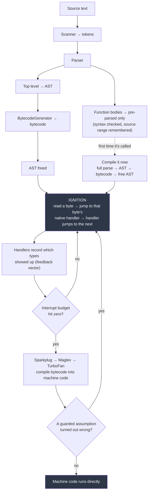

# Bytecode Dispatch and Tier-Up

## Maturity Target

- Priority: #deep-dive
- Study time: 45 minutes
- Interview signal: you can explain what "the interpreter runs the bytecode" actually means mechanically — that there is no interpreter loop, that the handlers were compiled before your code existed, and that tier-up is driven by a decrementing budget rather than a naive call counter.
- Production signal: you stop reasoning about warm-up and micro-benchmarks by folklore. You can explain why a once-called hot loop still gets optimized, why a fresh Node process is slow for a minute, and why an idle tab's "already optimized" code can be thrown away.
- Dependencies: [[02 - JavaScript Runtime Foundations/02 - JavaScript Engine and Runtime|JavaScript Engine and Runtime]], [[02 - JavaScript Runtime Foundations/04 - Call Stack|Call Stack]], [[02 - JavaScript Runtime Foundations/08 - Engine and Compilation Glossary|Engine and Compilation Glossary]]

## Source Anchors

- [V8 blog - Ignition: an interpreter for V8](https://v8.dev/blog/ignition-interpreter)
- [V8 blog - Sparkplug: a non-optimizing JavaScript compiler](https://v8.dev/blog/sparkplug)
- [V8 blog - Maglev: V8's fastest optimizing JIT](https://v8.dev/blog/maglev)
- [V8 Ignition design doc](https://docs.google.com/document/d/11T2CRex9hXxoJwbYqVQ32yIPMh0uouUZLdyrtmMoL44/mobilebasic)
- [V8 blog - Lazy deserialization / code flushing context](https://v8.dev/blog/short-builtin-calls)

## 1. Concept

Simple version: bytecode never "runs." Native code runs. Your bytecode is *data* that tells the CPU which pre-compiled blob of machine code to jump to next.

That single sentence dissolves most of the confusion in this area. [[02 - JavaScript Runtime Foundations/02 - JavaScript Engine and Runtime|Engine and Runtime]] gives you the tier names; this note gives you what actually happens inside the bottom tier and what makes a function leave it.

The accurate mechanism, in five claims:

1. **Compilation is per compilation unit, not per file and not per line.** A unit is the top level of a script, *each function body*, each module, each `eval` call. Nothing is left over — there is no "the rest of the code" category.
2. **Bytecode is the source of truth.** The AST is freed once bytecode exists. Every higher tier compiles *from* bytecode, and deoptimization returns *to* bytecode. Machine code is a disposable cache layered on top.
3. **There is no interpreter loop.** V8 uses indirect *threaded dispatch*: each bytecode handler ends with a tail call that jumps straight into the next handler. No `while (true)`, no central `switch`, no return to a parent frame.
4. **The handlers were compiled when Chrome was built.** Each opcode's handler is written in CodeStubAssembler/Torque and compiled to native code at build time, then embedded in the browser binary as a builtin.
5. **Tier-up runs on a budget, not a call count.** Each function carries an interrupt budget scaled to its bytecode length. It is charged at function entry *and at loop back-edges*, and when it hits zero V8 makes a tiering decision.



### Read one function all the way down

```js
function calc(price) {
  const total = price * 2;
  return total;
}
```

```txt
Parameter count 2          ; the receiver plus one declared argument
Register count 1
Frame size 8

  Ldar a0           ; accumulator ← price
  MulSmi [2], [0]   ; accumulator ← accumulator * 2
  Star0             ; r0 ← accumulator      (r0 is "total")
  Ldar r0           ; accumulator ← r0
  Return            ; return the accumulator
```

Three things changed on the way down from the AST:

- **The tree became a sequence.** Depth is gone. Children are evaluated before parents, so post-order traversal of the AST *is* the instruction order.
- **Names are gone.** `total` became `r0`, a numbered slot in the stack frame; `price` became `a0`, argument slot 0. Identifiers survive only as debug metadata for stack traces.
- **There is an accumulator.** Ignition is an accumulator-based register machine: one implicit register most instructions read from and write to. That is why `MulSmi` takes one real operand instead of three. Small bytecode matters, because V8 holds it in memory for as long as the function stays warm.

`[0]` is not a value. It is **feedback vector slot 0** — the index where this multiply records the types it observed. The profiling instrumentation lives physically inside the bytecode operands.

> [!tip] See it yourself
> `node --print-bytecode --print-bytecode-filter=calc file.js` prints exactly this. Pair it with **astexplorer.net** to watch tokens → AST → (mentally) bytecode for the same snippet. Twenty minutes with these two tools is worth more than any blog post.

## 2. Why It Matters

- It replaces the single most common wrong sentence in frontend interviews — *"JavaScript is interpreted line by line"* — with a mechanism you can defend under follow-up questions.
- Warm-up behaviour stops being mysterious. Post-deploy p95 spikes on an SSR server, microbenchmarks that flatter your code, and "it got fast after a few seconds" all fall out of the budget mechanism.
- It explains why nothing is permanent: cold functions get their machine code *and eventually their bytecode* thrown away, then recompiled from source. Only the source text survives indefinitely.
- It gives you the vocabulary — dispatch, handler, feedback slot, budget, back-edge, on-stack replacement, flushing — that separates "I read a blog post about V8" from "I understand the execution model."

## 3. "Interpreted line by line" — wrong three times over

**Lines don't survive tokenizing.** After the scanner there are only tokens. `const total = price * 2;` becomes a *flat list* — `Keyword const`, `Identifier total`, `Punctuator =`, `Identifier price`, `Punctuator *`, `Numeric 2`, `Punctuator ;`, `EOF`. Nothing in that list says `total` is being assigned, and nothing says `*` binds tighter than `=`. Line numbers persist only as metadata for stack traces.

**The source text is never consulted at runtime.** Once bytecode exists, the string is dead weight — kept only for lazy compilation of not-yet-called functions and for `fn.toString()`.

**The whole script is parsed before a single statement executes.** Here is the proof:

```js
console.log("hi");
const x = ;
```

Nothing prints. Not `"hi"` — nothing. The syntax error is entirely *after* the log, yet the log never happens, because parsing finished before execution began. A genuinely line-by-line interpreter would have printed `"hi"` and then failed.

> [!warning] Where the myth comes from
> Two real facts get fused into one false one. Statements really do execute in source order, and compilation really is lazy and on-demand. So it *looks* sequential. The grain of truth is that work is deferred **per function**, not per line.

## 4. How the bytecode actually runs

Four CPU registers stay permanently dedicated while Ignition is executing:

| Register | Holds |
| --- | --- |
| bytecode pointer | address of the current instruction |
| dispatch table pointer | base of an array of ~256 handler addresses, indexed by opcode |
| accumulator | the implicit operand that `Ldar` / `MulSmi` read and write |
| frame pointer | base of this frame — `r0` and `a0` are offsets from it |

### There is no loop

Every handler's last few instructions look like this:

```asm
movzx  rbx, byte [r14]        ; read the next opcode byte
mov    rax, [r15 + rbx*8]     ; look up that opcode's handler address
jmp    rax                    ; go there — and never come back
```

No `call`, no `ret`, no central `switch`, no `while (true)`. Control falls sideways from handler to handler. This is *indirect threaded dispatch*, and the reason for it is branch prediction: a single central dispatch branch would mispredict on essentially every bytecode, whereas each handler's own dispatch site gets its own prediction history. It costs roughly 10–15 cycles per bytecode, which is the number Sparkplug exists to delete.

Because the dispatch is a tail call, the handler chain does not grow the stack — the dispatch calling convention pins its parameters in fixed machine registers so they thread through without touching memory.

### The handlers are pre-compiled

Each opcode's handler is written in CodeStubAssembler (now mostly generated from Torque), compiled by TurboFan **when Chrome was built**, and embedded in the shipped binary as a builtin. `MulSmi` is a fixed blob of x86 that arrived with your browser download.

> [!warning] The sentence to remember
> Your bytecode is never translated in order to run. It only selects which pre-existing native blob runs next.

### What `MulSmi [2], [0]` actually does

1. Read the accumulator.
2. Check the low bit. V8 tags small integers (Smis) so a pointer and an integer are distinguishable at a glance. Fast path if it is a Smi.
3. `imul`, then check the overflow flag. On overflow, branch to the slow path that allocates a heap number.
4. **Write the observed type into feedback vector slot 0.**
5. Store the result back into the accumulator.
6. Advance the bytecode pointer past the operands, then dispatch.

Step 4 is the important one. Type feedback is not collected by a separate profiler thread watching your code; it is a store instruction inside the arithmetic itself.

## 5. When does a function leave Ignition?

Compiling to machine code is **optional**. A function that runs twice lives its whole life in Ignition and is then discarded.

Tier-up is driven by an **interrupt budget** attached to each function's feedback cell, sized relative to its bytecode length. Two events charge it:

```txt
function entry      → charge the budget
loop back-edge      → charge the budget   (the JumpLoop bytecode)
```

When the budget is exhausted, execution traps into the runtime, V8 makes a tiering decision, and the budget resets for the next tier. Higher tiers also gate on invocation counts and feedback stability — Sparkplug→Maglev is on the order of hundreds of invocations, and a *change* in collected feedback can reset the counter, because optimizing against feedback that is still moving is wasted work.

Three consequences worth internalizing:

**Loops count, so call count alone is not the trigger.** A function called *once* containing a million-iteration loop will tier up, because every back-edge charges the budget. Without this, the hottest code in your program — a single long-running loop — would never be optimized.

**It can swap tiers mid-flight.** If that loop is still running when compilation finishes, V8 performs **on-stack replacement**: it compiles a version of the function entered at the loop header, transfers live values out of the interpreter frame into the new frame, and jumps into machine code *without the function returning first*. Your loop changes tiers between two iterations. This is cheap specifically because Sparkplug's output is frame-compatible with Ignition's — same stack layout, same register conventions — so tiering up *and* tiering back down are both just a frame reinterpretation.

**Feedback has to exist before optimizing tiers can run.** The feedback vector is not even allocated on the first few calls. A function cannot reach Maglev or TurboFan until it has run enough to record some types. That is the real reason tiering is gradual: the optimizers need data, and data takes execution to produce.

### Deoptimization and flushing — the downhill directions

Optimized code contains bailout points. Pass an unexpected type and V8 discards the optimized code, reconstructs an interpreter stack frame mid-execution, and resumes in bytecode. This is why monomorphic code is fast — not magic, just fewer bailouts. (Shapes and inline caches are in [[02 - JavaScript Runtime Foundations/02 - JavaScript Engine and Runtime|Engine and Runtime]] §7.)

**Bytecode flushing** is the further step down. A function that goes cold can have its compiled code — and eventually its *bytecode* — thrown away under memory pressure, then recompiled from source if you call it again.

> [!tip] The one-line summary of the whole system
> Nothing here is permanent except the source text. Machine code, feedback vectors, and bytecode are all caches, and all three can be dropped.

## 6. Real Frontend Example: Bug → Fix → Tradeoff

The bug is in the *measurement*, which is the form this note's material actually shows up in at work.

```ts
// "Proving" that our new formatter is 4x faster before shipping it.
function benchmark(fn: (n: number) => string, label: string) {
  const t0 = performance.now();
  for (let i = 0; i < 5_000_000; i++) fn(i);
  console.log(label, performance.now() - t0);
}

benchmark(formatOld, "old"); // 180ms
benchmark(formatNew, "new"); //  45ms  ← ship it!
```

Trace, mechanically: five million back-edges charge the budget almost immediately, so `fn` reaches TurboFan within the first fraction of the loop and ~99.99% of the measured time is fully optimized machine code with a monomorphic call site and a Smi-only argument. In production, `formatNew` is called with mixed `number | string` input from an API, roughly 40 times per page view. It never leaves Ignition. The benchmark measured a tier the production code never reaches, on types it never sees.

```ts
// Fix: measure at production call counts, with production inputs, and read
// the tier rather than guessing at it.
const sample = realRowsFromFixture(); // mixed types, as the API returns them

performance.mark("fmt-start");
for (const row of sample.slice(0, 40)) formatNew(row.value);
performance.measure("fmt", "fmt-start");
```

```bash
# Confirm which tier actually ran, instead of inferring it from timings.
node --trace-opt --trace-deopt bench.js
node --print-bytecode --print-bytecode-filter=formatNew bench.js
```

Tradeoffs: small-N measurements are noisy, so you need many repetitions of a realistic workload rather than one giant loop — more setup work for a less quotable number. And `--trace-opt` output is V8-version-specific, so it is a diagnostic, not something to assert in a PR description. The honest position in an interview is that engine-level reasoning tells you *which measurements to distrust*; it does not replace profiling real workloads ([[13 - Performance and Memory/09 - Performance Checklist|Performance Checklist]]).

> [!warning] Footgun: the JIT flatters benchmarks and punishes production
> Any loop large enough to produce a stable number is large enough to have moved your code to a tier production will never reach. This is the single most common way frontend performance work goes wrong.

## 7. Compiler vs interpreter — the naming traps

> A compiler **translates** code. An interpreter **executes** code. These are different jobs, not mutually exclusive programs.

V8 is a runtime containing several compilers *and* an interpreter:

| Component | Job |
| --- | --- |
| Parser | understands JS syntax, produces an AST |
| BytecodeGenerator | walks the AST, emits bytecode |
| Ignition | dispatches bytecode to native handlers |
| Sparkplug / Maglev / TurboFan | compile bytecode to machine code |

Lazy compilation is a **design decision**, not a property of compilers or interpreters. V8 *could* compile everything eagerly; it chooses not to, to cut startup cost.

- **"Ignition is the interpreter."** Half right. In V8, *Ignition* names the whole subsystem, which includes the BytecodeGenerator — Ignition both generates and executes bytecode. Separating the two *jobs* is correct; the label just gets misapplied to only one of them.
- **"The interpreter generates the bytecode."** No. Three distinct components: parser → AST, generator → bytecode, interpreter → effects. Each stage consumes what the previous produced.
- **"Python and Ruby are pure interpreters."** No. CPython has compiled to bytecode since the beginning — that is what `.pyc` files are. Classic line-at-a-time BASIC is the fair example of a genuinely pure interpreter.

## 8. Interview Answer

Short answer:

> Bytecode doesn't run — native code runs, and the bytecode selects which native code runs next. V8 keeps a dispatch table of ~256 bytecode handlers that were compiled into the Chrome binary at build time, and each handler ends by tail-jumping straight into the next one, so there's no interpreter loop at all. Handlers also write type feedback as a side effect of doing their arithmetic. Each function carries an interrupt budget scaled to its bytecode size, charged on function entry and on loop back-edges; when it runs out, V8 decides whether to compile the function with Sparkplug, Maglev, or TurboFan.

Deeper answer:

> Compilation is per compilation unit — top level, each function body, each module, each `eval` — and function bodies are only pre-parsed until first call, at which point they're fully parsed and compiled mid-execution of the caller. Once bytecode exists the AST is freed, which makes bytecode the source of truth: every tier compiles from it and every deopt returns to it. Because back-edges charge the budget, a function called once with a hot loop still tiers up, and if the loop is still running when compilation finishes V8 does on-stack replacement — compiles an entry at the loop header, moves live values into the new frame, and jumps in without the function returning. That's cheap because Sparkplug's frames are layout-compatible with Ignition's, which also makes tiering *down* cheap. And the downhill direction goes further than deopt: cold functions can have their machine code and even their bytecode flushed and regenerated from source. Nothing in the system is permanent except the source text.

## 9. Practice

1. <details><summary>Why does `console.log("hi"); const x = ;` print nothing, and what does that prove?</summary>The whole script is parsed to completion before any statement executes, so the syntax error on line 2 is discovered before line 1 ever runs. It proves execution is not line-by-line: a line-at-a-time interpreter would have printed "hi" first. The grain of truth in the myth is that compilation is deferred per function, not per line.</details>
2. <details><summary>A colleague says "the interpreter loops over the bytecode array, switching on each opcode." Correct them precisely.</summary>There is no loop and no switch. V8 uses indirect threaded dispatch: each handler ends with a tail call that reads the next opcode byte, indexes the dispatch table to get that opcode's handler address, and jumps to it. Control falls sideways from handler to handler and never returns to a parent. The motivation is branch prediction — one central dispatch branch would mispredict on nearly every bytecode, so each handler gets its own dispatch site with its own prediction history.</details>
3. <details><summary>A function is called exactly once. Can it reach TurboFan? Explain the mechanism, not just yes or no.</summary>Yes, if it contains a hot loop. Tier-up is driven by an interrupt budget charged at function entry and at every loop back-edge (the JumpLoop bytecode), not by an invocation counter alone. A single call running a million iterations exhausts the budget through back-edges. If the loop is still executing when compilation finishes, V8 performs on-stack replacement: it compiles a version entered at the loop header, migrates live values from the interpreter frame into the new frame, and jumps into machine code without the function returning first.</details>
4. <details><summary>Transfer question: your Next.js SSR pods show a p95 latency spike for about a minute after every deploy, then recover. Nothing in the code changed. What is happening, and what is one mitigation?</summary>JIT state lives in the process and dies with every restart. A fresh Node process starts executing render-path functions in Ignition with no feedback vectors allocated, and they only tier up through Sparkplug, Maglev, and TurboFan as feedback accumulates under real traffic. Mitigation: warm the hottest routes with synthetic requests in a deploy hook before the instance joins the load balancer, so tier-up is paid for by warmup traffic rather than real users.</details>
5. <details><summary>Why is bytecode, rather than the AST, described as the source of truth?</summary>The AST is freed as soon as the BytecodeGenerator has emitted bytecode. Every optimizing tier compiles from bytecode, and deoptimization reconstructs an interpreter frame and resumes in bytecode. Machine code is therefore a disposable cache on top of bytecode. The one caveat is that bytecode itself can be flushed when a function goes cold and regenerated from the retained source text, which is the only thing that persists indefinitely.</details>

## Related Notes

- [[02 - JavaScript Runtime Foundations/02 - JavaScript Engine and Runtime|JavaScript Engine and Runtime]] — the tier table, hidden classes, inline caches, and startup cost. Read that first.
- [[02 - JavaScript Runtime Foundations/08 - Engine and Compilation Glossary|Engine and Compilation Glossary]] — plain-English definitions for every term used here.
- [[02 - JavaScript Runtime Foundations/03 - Execution Context|Execution Context]]
- [[02 - JavaScript Runtime Foundations/04 - Call Stack|Call Stack]] — the frames that OSR migrates between.
- [[03 - Scope and Variables/04 - Hoisting and TDZ|Hoisting and TDZ]] — the TDZ is a literal sentinel value written into a context slot; the bytecode proof lives there.
- [[26 - How the Web Works/06 - How V8 Runs Your Code|How V8 Runs Your Code]] — shapes and IC states from the performance angle.
- [[13 - Performance and Memory/09 - Performance Checklist|Performance Checklist]]
- [[19 - DOM and Browser APIs/01 - DOM Fundamentals and the Render Pipeline|DOM Fundamentals and the Render Pipeline]] — where machine code hands off to browser C++.
