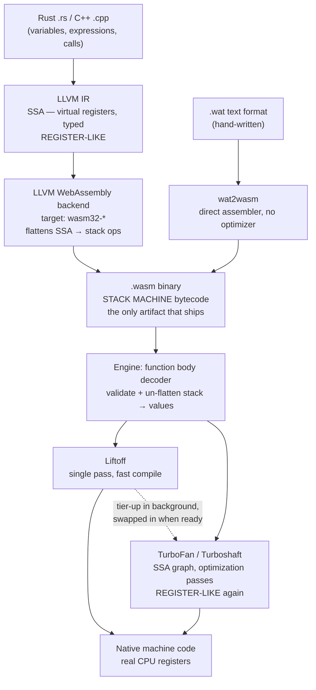

# Compiling to WebAssembly

## Maturity Target

- Priority: #deep-dive
- Study time: 35-45 minutes
- Interview signal: you can trace a `.wasm` file from Rust source to executing machine code, name what each layer owns, and explain why a "compiled" Wasm binary still has to be compiled again on arrival.
- Production signal: you can read a `.wasm` in a hex editor, reason about what makes it fast to load, and pick the right target and toolchain flags without guessing.
- Dependencies: [[32 - Compilation and Machine Foundations/02 - Stack Register and Accumulator Bytecode|Stack, Register and Accumulator Bytecode]] · [[32 - Compilation and Machine Foundations/03 - LLVM and Compiler IR|LLVM and Compiler IR]]

## Source Anchors

- [WebAssembly Core Specification - Binary Format](https://webassembly.github.io/spec/core/binary/index.html)
- [WebAssembly Core Specification - Validation](https://webassembly.github.io/spec/core/valid/index.html)
- [V8 - Liftoff, a new baseline compiler for WebAssembly](https://v8.dev/blog/liftoff)
- [LLVM - WebAssembly target (`llvm/lib/Target/WebAssembly`)](https://llvm.org/docs/index.html)
- [MDN - Compiling from Rust to WebAssembly](https://developer.mozilla.org/en-US/docs/WebAssembly/Guides/Rust_to_Wasm)

## 1. Concept

**Simple explanation.** A `.wasm` file is not machine code and cannot run on a CPU. It is portable bytecode, so every engine compiles it again on arrival. Which means a Rust-to-Wasm program is compiled **twice**: once by LLVM on your build machine, once by the engine on the user's machine.

**Accurate mechanism.** The thing worth internalizing is where the stack machine lives.



Read the capitalized labels top to bottom: **register-like → stack → register-like**. The stack machine exists in exactly one place — the wire format — bracketed on both sides by register-based representations.

### The stack machine belongs to Wasm, not to Rust or C++

This is the question most people get wrong, and it is worth stating flatly: **nothing about C++ or Rust is stack-machine-shaped.** Their semantics are variables, expressions and calls. LLVM IR, which both compile into, is SSA with unlimited virtual registers — register-like, explicitly not a stack (see [[32 - Compilation and Machine Foundations/03 - LLVM and Compiler IR|LLVM and Compiler IR]]).

The stack encoding is a **choice made by the WebAssembly specification**, applied at the last moment of the build: LLVM's Wasm backend has to serialize register-like SSA values into Wasm's instruction format, and that format is stack-based, so the backend flattens `%sum = add i32 %a, %b` into `local.get 0; local.get 1; i32.add`. Then the engine's decoder immediately un-flattens it — it keeps a compile-time bookkeeping structure (literally called a *value stack* in engine source) to track what is conceptually on the stack, purely so it can decide which real register or stack slot each value should live in.

So the operand stack is never executed. It is an **encoding trick in the middle**, and the two reasons it was chosen are both about the wire format, not about execution:

- **Single-pass validation.** Type-checking is one linear walk tracking stack depth and types. That is a security property, not a nicety — untrusted bytes must be proven safe before compilation.
- **Compactness.** No operand slots to encode, so opcodes are mostly one byte.

> [!warning] "Wasm is binary, so it's machine code and runs directly"
> Two different senses of "binary" collapsed into one. Wasm *is* binary in the sense of "bytes, not text" — that is what distinguishes `.wasm` from `.wat`. It is *not* machine code, which means one specific CPU's native instruction set. The two are independent axes:
>
> | | Text encoding | Binary encoding |
> | --- | --- | --- |
> | **Abstract, portable instructions** | `.wat` | **`.wasm`** ← what you download |
> | **Native CPU instructions** | assembly (`mov eax, ebx`) | machine code |
>
> `.wasm` and machine code are both bytes and live in different rows. Getting from the top row to the bottom row is the compilation step Liftoff and TurboFan perform. Full term-by-term breakdown in [[32 - Compilation and Machine Foundations/01 - From Source Text to Silicon|From Source Text to Silicon]].

### Trace: a complete, valid `.wasm` module, byte by byte

The whole thing — a module exporting one function that adds two `i32`s:

```wat
(module
  (func $add (param $a i32) (param $b i32) (result i32)
    local.get $a
    local.get $b
    i32.add)
  (export "add" (func $add)))
```

41 bytes. This listing is verified — feed exactly these bytes to `WebAssembly.instantiate` and `exports.add(2, 3)` returns `5`:

```txt
00 61 73 6D              magic: the ASCII bytes \0asm
01 00 00 00              version 1

01                       section id 1 = type
   07                    section byte length
   01                    1 type in this section
   60                    functype marker
   02 7F 7F              2 params: i32 (0x7F), i32
   01 7F                 1 result: i32

03                       section id 3 = function
   02                    length
   01 00                 1 function, using type index 0

07                       section id 7 = export
   07                    length
   01                    1 export
   03 61 64 64           name: length 3, then "add"
   00 00                 kind 0x00 = func, index 0

0A                       section id 10 = code
   09                    length
   01                    1 function body
   07                    body byte length
   00                    0 local declarations
   20 00                 local.get 0
   20 01                 local.get 1
   6A                    i32.add
   0B                    end
```

Two structural facts to take from this:

1. **Every section is tagged and length-prefixed.** Decoding is "read a section id byte, read a length, read that many bytes" — no ambiguity, no lookahead, no backtracking. That is *why* Wasm decodes and validates faster than parsing JavaScript text ever could, and it is the concrete mechanism behind the "fast to validate" claim everyone repeats.
2. **Opcodes are one byte and there are no registers in sight.** `0x20` is `local.get`, `0x6A` is `i32.add`, `0x0B` is `end`. And the type is *in the opcode* — `i32.add` and `f64.add` are different bytes — which is why no type feedback is ever needed. See [[32 - Compilation and Machine Foundations/11 - Wasm Speculation and Deopt|Wasm Speculation and Deopt]] for what that does and does not buy.

Those 6 bytes of function body become a handful of x86-64 instructions:

```asm
mov eax, [rbp-4]     ; local 0
add eax, [rbp-8]     ; + local 1
```

### What "the Wasm backend" actually is

Neither `rustc` nor `clang` generates code themselves — both hand LLVM IR to LLVM, and LLVM picks a **backend** from the target triple. `x86_64-unknown-linux-gnu` selects the x86 backend, which knows about `rax`, instruction encodings and calling conventions. `wasm32-unknown-unknown` selects the WebAssembly target (LLVM's `llvm/lib/Target/WebAssembly`), which knows Wasm's rules: no fixed register set, stack-based instruction encoding, the section format, opcodes like `local.get`. The frontend does not change at all — only the backend selection does.

```sh
rustc --target wasm32-unknown-unknown main.rs
clang++ --target=wasm32 main.cpp
```

> [!tip] The Wasm backend is an unusual backend, and that is the whole point
> Every other LLVM backend emits machine code for physical hardware. This one emits portable bytecode instead — so its output is not the end of the road. A *second* backend-like step is still required on the user's machine to reach real instructions: Liftoff and TurboFan inside V8, or Cranelift inside Wasmtime, or whichever engine receives the file. That is the price of portability, and it is the same trade as [[32 - Compilation and Machine Foundations/04 - AOT JIT and the Portability Tradeoff|Java's bytecode]] — the CPU-specific step is deferred to the machine that finally knows the CPU.

### Why the engine has two tiers

V8 originally compiled Wasm with TurboFan only. TurboFan produces excellent code and is slow to compile, so a multi-megabyte module from a C++ game meant a long delay before *anything* could run. **Liftoff** fixed that: one pass over the bytecode, emit machine code directly, minimal analysis, no optimization — fast enough that it can often compile faster than the bytes stream in over the network. Execution starts almost immediately on naive-but-correct code, while TurboFan recompiles hot functions in the background and V8 swaps the optimized versions in.

Same shape as the JavaScript ladder (Ignition → Sparkplug → Maglev → TurboFan) and for the same reason: get something running now, spend real compile time only on what turns out to matter. The difference is that Wasm's tiering needs no warm-up period to learn types — they are already in the binary.

## 2. Why It Matters

- It is the answer to "why does a compiled language still need compiling in the browser?" — and the answer names a real design tradeoff rather than an inefficiency.
- It settles where the stack machine lives, which is the single most common confusion about Wasm and the one an interviewer can probe.
- The section structure explains the load-time performance story concretely, so "Wasm starts fast" becomes a mechanism you can defend.
- It tells you which knob to reach for: build-time flags change what LLVM emits, engine behaviour changes what happens on arrival, and they are different levers.

## 3. Real Frontend Example: Bug → Fix → Tradeoff

A team ships a Rust image codec as Wasm. It works, but the Performance panel shows a 400 ms gap between the response arriving and the first pixel — on a module that only takes 90 ms to run.

```ts
// ❌ Download fully, then compile, then instantiate — three serial phases
const res = await fetch("/codec.wasm");
const bytes = await res.arrayBuffer();          // wait for every byte
const module = await WebAssembly.compile(bytes); // only now start compiling
const instance = await WebAssembly.instantiate(module, imports);
```

Trace: `arrayBuffer()` does not resolve until the last byte lands, so compilation cannot begin until download is completely finished — the two phases are serialized for no reason. Wasm's whole binary design exists to make this unnecessary: sections are tagged and length-prefixed precisely so a decoder can work forward through a partial stream, and Liftoff compiles fast enough to keep up with the network. This pipeline throws that away.

```ts
// ✅ Stream: decode and compile while the bytes are still arriving
const { instance } = await WebAssembly.instantiateStreaming(
  fetch("/codec.wasm", { credentials: "omit" }),
  imports,
);
```

`instantiateStreaming` consumes the response as it arrives, so Liftoff compiles the early sections while later ones are still in flight. On a repeat visit the browser can also reuse its cached compiled code rather than compiling again at all.

Tradeoffs, all real: the server must send `Content-Type: application/wasm` or the streaming path refuses and you silently fall back to the slow one — a deploy-config dependency that is easy to break and invisible in dev; streaming gives you no chance to inspect or patch the bytes before compiling, which some polyfill and instrumentation setups rely on; and the response cannot be one you already read for something else, so you lose the option of caching the raw `ArrayBuffer` in IndexedDB yourself. And none of this helps if the real problem is the 2 MB download — check [[32 - Compilation and Machine Foundations/03 - LLVM and Compiler IR|the build flags]] first.

> [!tip] Separate the three costs before optimizing
> Download, compile, and run are three different numbers with three different fixes. Download → build flags, `wasm-opt`, lazy-loading behind the interaction. Compile → streaming instantiation and code caching. Run → algorithm, memory layout, boundary crossings. Measure which one the 400 ms actually was; the wrong fix here is very cheap to apply and does nothing.

## 4. Interview Answer

Short answer:

> A `.wasm` file is portable stack-machine bytecode, not machine code, so the engine has to compile it on arrival — V8 does that with Liftoff, a single-pass baseline compiler that starts execution almost immediately, then re-compiles hot functions with TurboFan in the background. So Rust-to-Wasm is compiled twice: LLVM on the build machine, the engine on the user's machine.

Deeper answer:

> The interesting part is where the stack machine lives. Rust and C++ are not stack-shaped, and LLVM IR is SSA with virtual registers — register-like. The stack encoding is Wasm's wire-format choice, and LLVM's WebAssembly backend flattens SSA values into `local.get`/`i32.add` sequences only at the final serialization step. The engine's decoder then immediately un-flattens it, keeping a compile-time value stack purely to decide which physical register each value belongs in. So the pipeline goes register-like, to stack, back to register-like, and the operand stack is never executed at all. Wasm chose that encoding for compactness and for single-pass validation, which is a security requirement for untrusted bytes rather than a convenience. The binary itself is a magic number, a version, then tagged length-prefixed sections — type, function, export, code — which is exactly why it decodes fast enough that `instantiateStreaming` can compile while the file is still downloading. And LLVM's Wasm backend is unusual in that its output is not machine code, which is why a second compilation step on the user's machine is unavoidable — the same portability trade as JVM bytecode.

## 5. Practice

1. <details><summary>"Wasm is binary, so the CPU runs it directly." Name both errors.</summary>First, "binary" is conflated: <code>.wasm</code> is binary in the sense of bytes-not-text, while machine code means one CPU's native instruction set. Both are bytes; only one is hardware instructions. Second, Wasm's instructions are abstract stack-machine operations with no registers and no target architecture, so no silicon decodes them — an engine must compile them to the local instruction set first, which is exactly what Liftoff and TurboFan do.</details>
2. <details><summary>Rust compiles to Wasm. Which layer introduces the stack machine, and which layers on either side of it are register-based?</summary>LLVM's WebAssembly backend introduces it, at the final serialization step. On the build side, LLVM IR is SSA with unlimited virtual registers. On the run side, the engine's decoder un-flattens the stack ops and its optimizing tier works on an SSA graph before allocating physical registers. Register-like → stack → register-like; the stack exists only as a wire format.</details>
3. <details><summary>Why is a <code>.wasm</code> binary fast to validate, and why is that a security property rather than a convenience?</summary>Every section is tagged and length-prefixed and the instructions are statically typed, so validation is one linear forward pass tracking stack depth and types — no backtracking, no ambiguity. It's a security property because the bytes are untrusted: the engine must <em>prove</em> type and stack safety before compiling anything, and a format that made that proof expensive would either slow every load or tempt engines to skip it.</details>
4. <details><summary>Your Wasm module shows a 400 ms gap between response and first execution. What are the three candidate costs and their distinct fixes?</summary>Download (fix: build flags for size, <code>wasm-opt</code>, lazy-load behind the interaction), compile (fix: <code>instantiateStreaming</code> so compilation overlaps the download, plus code caching on repeat visits), and run (fix: algorithm, memory layout, fewer boundary crossings). They are different numbers; measure which one it is before choosing.</details>
5. <details><summary>Transfer: LLVM's Wasm backend emits bytecode rather than machine code, so a second compile is needed later. Which module-32 tradeoff is that, restated?</summary>The AOT-versus-JIT portability trade — the CPU-specific step is deferred to the machine that finally knows the CPU. Same reason <code>javac</code> stops at JVM bytecode. Committing to a target buys startup and loses portability; deferring buys portability and costs a compile on arrival, which Liftoff exists to make cheap.</details>

## Related Notes

- [[32 - Compilation and Machine Foundations/11 - Wasm Speculation and Deopt|Wasm Speculation and Deopt]] — what static typing does and does not remove.
- [[32 - Compilation and Machine Foundations/01 - From Source Text to Silicon|From Source Text to Silicon]] — binary, bytecode, assembly, machine code, hex.
- [[32 - Compilation and Machine Foundations/02 - Stack Register and Accumulator Bytecode|Stack, Register and Accumulator Bytecode]] — why Wasm chose stack, and the two orthogonal axes.
- [[32 - Compilation and Machine Foundations/03 - LLVM and Compiler IR|LLVM and Compiler IR]] — the frontend/backend split and target triples.
- [[32 - Compilation and Machine Foundations/04 - AOT JIT and the Portability Tradeoff|AOT, JIT and the Portability Tradeoff]] — the trade this note is an instance of.
- [[02 - JavaScript Runtime Foundations/02 - JavaScript Engine and Runtime|JavaScript Engine and Runtime]] — the Wasm compilation bypass, at must-know depth.
