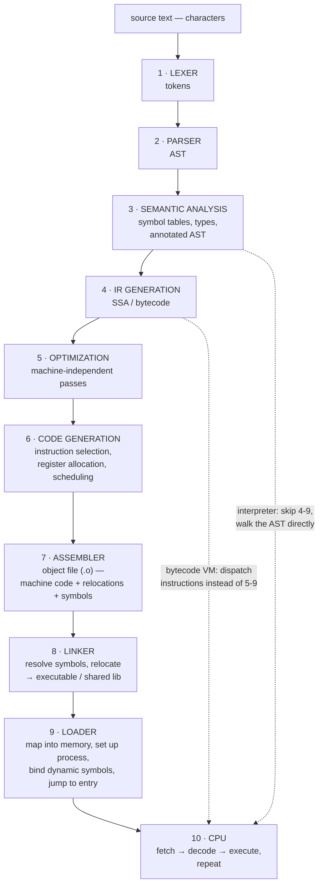

# Compiled vs Interpreted, and Every Stage Between

## Maturity Target

- Priority: #deep-dive
- Study time: 50-60 minutes, and it is the front door to this module
- Interview signal: asked "is JavaScript compiled or interpreted?", you dissolve the question instead of picking a side — and you can name every stage from characters to executing instructions, and say which stage reports which class of error.
- Production signal: you can place any tool you use (`tsc`, Babel, esbuild, a minifier, a bundler, V8) at a specific stage, which tells you what it can and cannot possibly catch or fix.
- Dependencies: none — read this first if the compiled-versus-interpreted question is what brought you here. It routes to every other note in the module.

## Source Anchors

- [ECMAScript specification - Lexical Grammar](https://tc39.es/ecma262/#sec-ecmascript-language-lexical-grammar)
- [ECMAScript specification - Automatic Semicolon Insertion](https://tc39.es/ecma262/#sec-automatic-semicolon-insertion)
- [LLVM Language Reference Manual](https://llvm.org/docs/LangRef.html)
- [Meta Engineering - Hermes: an open source JavaScript engine optimized for mobile apps](https://engineering.fb.com/2019/07/12/android/hermes/)
- [Linkers and Loaders (John Levine) - reference on object files and linking](https://linker.iecc.com/)

## 1. Concept

**Simple explanation.** "Compiled language" and "interpreted language" are not real categories. Compiling and interpreting are things an *implementation* does, and almost every serious language implementation today does both. What actually varies is *which stages run on whose machine, and when*.

**Accurate mechanism.** Start by dissolving the dichotomy, because carrying it makes the rest incoherent.

### The dichotomy is a property of implementations, not languages

A language is a specification — a grammar and a semantics. Nothing in it says how it must be executed. The proof is that the same language gets both treatments:

| Language | "Obviously" | But also |
| --- | --- | --- |
| C, C++ | Compiled to native binaries | Cling interprets C++ interactively; `tcc -run` executes C without producing a binary |
| Python | Interpreted | `python` compiles source to bytecode (`.pyc`) first, then interprets that |
| Java | Compiled | `javac` stops at bytecode; the JVM interprets it, then JIT-compiles hot methods |
| **JavaScript** | Interpreted | V8 compiles to bytecode then to machine code through four tiers; **Hermes AOT-compiles JS to bytecode during the app build and ships with no JIT at all** |

That last row is the one worth remembering, because it is a tool you may already use. Meta's Hermes engine, built for React Native, "uses an ahead-of-time compiler, which runs as part of the mobile application build process," and its 2019 design shipped with **no JIT compiler** — an explicit choice, because a JIT costs native code size, memory and warm-up, which are exactly the metrics a mobile app start cares about. Same language as V8 runs. Opposite strategy.

So "is JavaScript compiled or interpreted?" has no answer, and saying so *is* the answer. The useful question is the three axes:

1. **Encoding** — stack, register, or accumulator bytecode ([[32 - Compilation and Machine Foundations/02 - Stack Register and Accumulator Bytecode|note 02]]).
2. **Execution strategy** — dispatch instructions one at a time, or translate to machine code ([[32 - Compilation and Machine Foundations/09 - Interpreters Dispatch and the Two Stacks|note 09]]).
3. **When** — on the build machine, or on the user's ([[32 - Compilation and Machine Foundations/04 - AOT JIT and the Portability Tradeoff|note 04]]).

### Every stage, once, end to end



Everything below is one stage. **The dotted lines are the point**: an implementation can leave the highway early. A tree-walking interpreter stops after stage 3. A bytecode VM stops after stage 4. An AOT compiler drives all the way to 9. Nobody skips stage 10.

### The whole pipeline on one screen

This table is the note. Read it first as a map, and on any re-read use it instead of the sections below — go back only to a row you cannot expand from memory.

| # | Stage | In → Out | Owns which error | A tool you use that lives here |
| --- | --- | --- | --- | --- |
| 1 | Lexer | characters → tokens | illegal character, unterminated string | every parser's first pass; ASI lives at its boundary with 2 |
| 2 | Parser | tokens → AST | **syntax errors**, and only these | Babel/SWC parse, Prettier (parse then re-print) |
| 3 | Semantic analysis | AST → symbol tables, types | **type errors**, unresolved names, early errors | **`tsc`** — this stage plus erasure, and nothing after |
| 4 | IR generation | AST → SSA or bytecode | — | V8's BytecodeGenerator; LLVM IR from rustc |
| 5 | Optimization | IR → better IR | — | TurboFan's passes; `wasm-opt`; a minifier's transforms |
| 6 | Code generation | IR → assembly / object code | — | minifiers (this is where names die), Sparkplug, Liftoff |
| 7 | Assembler | assembly → object file (code + symbols + relocations) | — | — |
| 8 | Linker | many objects → one artifact | **unresolved reference** | **your bundler** — see the callout in stage 8 |
| 9 | Loader | artifact → live process | missing shared library | the browser loading and instantiating a module graph |
| 10 | CPU | fetch → decode → execute | everything else — **runtime errors** | the Performance panel |

The right-hand column is the practical payoff: it tells you what each tool can *possibly* catch. `tsc` cannot know an API's real shape, because that fact does not exist until stage 10.

---

#### Stage 1 — Lexical analysis (lexer / tokenizer / scanner)

Characters in, **tokens** out. `const x = 1 + 2;` becomes roughly `Keyword(const) Ident(x) Punct(=) Num(1) Punct(+) Num(2) Punct(;)`. Whitespace and comments are usually discarded here, which is why formatting cannot change program meaning — with one famous exception, below.

The theory: token structure is a **regular language**, so a lexer is a finite automaton and needs no memory of nesting. That is why it is fast and why it cannot decide anything structural. It resolves ambiguity by **longest match** (maximal munch): `a---b` lexes as `a -- - b`, not `a - -- b`, because `--` is a longer valid token than `-`. Errors here are rare and shallow — an unterminated string, an illegal character.

> [!warning] The one place JavaScript's whitespace *does* change meaning
> Automatic semicolon insertion is a lexer/parser interaction: the lexer records whether a line terminator preceded a token, and the parser's error-recovery rules consult it. So this silently returns `undefined`:
> ```js
> function build() {
>   return
>     { ok: true };   // a semicolon is inserted after `return`
> }
> ```
> Nothing is unreachable, nothing throws, no linter rule fires by default. It is a *parsing* outcome that produces valid, wrong code — which is the whole argument for why the front end is not academic. Put the `{` on the same line, or wrap in parentheses.

#### Stage 2 — Parsing

Tokens in, **abstract syntax tree** out. `1 + 2 * 3` becomes `Add(1, Mul(2, 3))` — and note the tree already encodes precedence, so the AST is where "operator precedence" physically lives.

The theory: programming-language syntax is (mostly) a **context-free grammar**, which needs a stack — hence recursion — and cannot be done by a finite automaton. Two families of implementation:

- **Hand-written recursive descent.** One function per grammar production, calling each other; a predictive (LL) parser decides which production to take from a token or two of lookahead. Binary operators are handled by **precedence climbing** (Pratt parsing): a loop that consumes operators while their binding power exceeds a threshold, recursing for the right operand. Naive recursive descent cannot handle **left recursion** (`Expr → Expr '+' Term` recurses forever), which is exactly why precedence climbing exists.
- **Parser generators** — yacc/bison, ANTLR — take a grammar file and generate a bottom-up (LR/LALR) table-driven parser. More powerful on paper, and largely abandoned for production language implementations: **V8, Clang and rustc all hand-write recursive-descent parsers**, because hand-written parsers give far better error messages, easier error recovery, and speed you can profile.

JavaScript's grammar is genuinely nasty and the spec admits it. `{` at statement position is a block, but the same token elsewhere is an object literal. `(a, b)` could be a parenthesized comma expression or an arrow function's parameter list, and you cannot know until you see whether `=>` follows. The spec handles this with **cover grammars** — productions like `CoverParenthesizedExpressionAndArrowParameterList` that parse the ambiguous shape once and reinterpret it afterwards. V8 additionally runs a cheap **pre-parser** over function bodies to find their boundaries without building full ASTs ([[02 - JavaScript Runtime Foundations/09 - Bytecode Dispatch and Tier-Up|lazy compilation]]).

Errors here are **syntax errors**, and they are the only errors a parser can report.

#### Stage 3 — Semantic analysis

AST in, **annotated AST plus symbol tables** out. This stage answers questions syntax cannot: does this name refer to anything, and do the types line up?

- **Binding / scope resolution.** Walk the tree building a symbol table per scope, and attach each identifier use to its declaration. Static semantics settle *which* declarations exist in which scope and which programs are outright invalid (an early error such as a duplicate `let`). What they do **not** do is execute anything: at runtime, entering a scope creates its lexical bindings **uninitialized**, they become initialized when evaluation reaches the declaration, and reading one before that throws the TDZ `ReferenceError` — V8 implements it with a sentinel value checked on access. So the *shape* of scope is static and the *initialization and the error* are runtime ([[03 - Scope and Variables/04 - Hoisting and TDZ|Hoisting and TDZ]] traces the runtime mechanism).
- **Type checking.** Compare declared and inferred types; report mismatches. Errors here are **type errors** — a different class from syntax errors, reported by a different stage, which is why `tsc` can pass on code that is syntactically fine and semantically wrong in a way it wasn't asked about.

> [!tip] This is exactly what `tsc` is, and exactly what it is not
> TypeScript is stages 1-3 plus a code generator that **erases**. It runs the lexer and parser, does real semantic analysis, and then emits JavaScript with the type annotations deleted. It never reaches stages 4-10. That single sentence explains the whole shape of TypeScript's guarantees: everything it knows, it knows at stage 3, and none of that knowledge survives into the program — so any fact that only becomes true at runtime (an API response's real shape) is outside its reach by construction. See [[23 - TypeScript Deep Dive/01 - Type System Mental Model|Type System Mental Model]] and [[23 - TypeScript Deep Dive/05 - unknown Runtime Validation and Boundaries|Runtime Validation and Boundaries]].

#### Stage 4 — IR generation

The annotated AST is lowered to an **intermediate representation**: LLVM IR for Clang and rustc, bytecode for V8 and the JVM. This is the fork in the road — a shipped IR is bytecode ([[32 - Compilation and Machine Foundations/02 - Stack Register and Accumulator Bytecode|encodings]]), a compiler-internal one is not ([[32 - Compilation and Machine Foundations/03 - LLVM and Compiler IR|LLVM and Compiler IR]]).

#### Stage 5 — Optimization

Machine-independent passes over the IR: constant folding, dead-code elimination, common subexpression elimination, inlining, loop-invariant code motion. These need explicit dataflow, which is why serious optimizers use register/SSA IR even when their input was stack bytecode.

#### Stage 6 — Code generation

Target-specific. Three jobs: **instruction selection** (which real instructions implement this IR operation), **register allocation** (liveness → assignment → spilling, the three steps in [[32 - Compilation and Machine Foundations/02 - Stack Register and Accumulator Bytecode|note 02]]), and **instruction scheduling** (order instructions to suit the pipeline). Output is assembly text or object code directly.

#### Stage 7 — Assembly and object files

The **assembler** turns assembly mnemonics into machine-code bytes by table lookup — no analysis ([[32 - Compilation and Machine Foundations/01 - From Source Text to Silicon|assembly and machine code are one layer in two notations]]). But an object file (`.o`; ELF on Linux, Mach-O on macOS, COFF on Windows) is not yet runnable, because it contains three things:

- machine code for this translation unit;
- a **symbol table** — what this file defines, and what it needs from elsewhere;
- **relocations** — "the address in these bytes is a placeholder; patch it once you know where that symbol landed."

#### Stage 8 — Linking

The **linker** takes many object files plus libraries and produces one executable or shared library. It resolves every undefined symbol against some definition and applies the relocations. This is why "undefined reference to `foo`" is a *link* error, not a compile error — each file compiled fine on its own; the failure is that nothing defined `foo`.

- **Static linking** copies library code into the executable: bigger binary, no runtime dependency, one artifact.
- **Dynamic linking** records "I need `libssl.so`" and defers to load time: smaller binary, shared memory across processes, patchable without rebuilding — and the possibility of it being missing or the wrong version.

> [!tip] Your bundler is a linker, and this is the most useful transfer in the note
> A JS bundler does the linker's job on modules: collect translation units, resolve every import against an export, error on unresolved ones, patch references, emit one artifact. So **bundling is static linking**, `externals` and import maps are **dynamic linking**, code splitting is **lazy dynamic loading**, and tree-shaking is the linker's dead-code elimination over a closed world. Which is why the failure modes rhyme exactly: an unresolved import is "undefined reference", a duplicated dependency is diamond-dependency symbol conflict, and a component reachable only through a runtime string is invisible to a closed-world reachability proof ([[32 - Compilation and Machine Foundations/05 - Reflection and Compile-Time Codegen|Reflection and Compile-Time Codegen]], [[10 - Modules/07 - Tree Shaking and Code Splitting|Tree Shaking and Code Splitting]]).

#### Stage 9 — Loading

Running a program is not "the CPU opens the file." The OS **loader** maps the executable's segments into a fresh virtual address space, sets up the stack and heap, hands off to the dynamic linker to bind shared-library symbols (typically lazily, through indirection tables, so a function's address is resolved on first call), and finally jumps to the entry point.

#### Stage 10 — Execution

The CPU runs one loop forever: **fetch** the instruction at the program counter, **decode** it — the opcode bits physically select which functional units activate — **execute**, update the program counter, repeat. There is no software here. Real cores overlap many of these steps at once (pipelining, superscalar issue, branch prediction, speculative execution), which is why branch predictability shows up as a real cost in [[32 - Compilation and Machine Foundations/09 - Interpreters Dispatch and the Two Stacks|interpreter dispatch]] and why memory locality dominates in [[32 - Compilation and Machine Foundations/07 - Registers Caches and RAM|Registers, Caches and RAM]].

---

### The four implementation strategies

| | What ships | On the user's machine | Startup | Peak speed | Examples |
| --- | --- | --- | --- | --- | --- |
| **AOT compile** | Native binary (stages 1-9 done) | Stage 10 only | Instant | Highest, no warm-up | C, C++, Rust, Go, GraalVM Native Image |
| **Tree-walking interpreter** | Source | Stages 1-3, then walk the AST | Fast for small inputs | Lowest — per-node dispatch, no IR at all | Ruby before 1.9, most toy languages, shell, and most template engines and expression DSLs in your own codebase |
| **Bytecode + interpreter** | Source or bytecode | Stage 4 if needed, then dispatch | Fast | Modest | CPython, Hermes, JVM in interpreter-only mode |
| **Bytecode + JIT** | Source or bytecode | Stages 4-6 at runtime, tiered | Fast, then improves | Near-native once hot | V8, SpiderMonkey, HotSpot, PyPy |

Two things worth noticing. **Tree-walking is the strategy you have most likely implemented yourself** without calling it that — any time you have interpreted a filter expression, a permission rule, a formula, or a JSON-defined condition by recursing over its structure, that was a tree-walking interpreter, and the fix when it got slow was to stop re-walking ([[32 - Compilation and Machine Foundations/09 - Interpreters Dispatch and the Two Stacks|closure compilation]]). And **Hermes and V8 occupy different rows for the same language**, which is the dichotomy dissolving in practice.

### So where does JavaScript sit

The honest answer, and it is a better interview answer than either alternative: **JavaScript is a specification; V8 is an implementation that both compiles and interprets.** Source is parsed and compiled to bytecode per function, lazily. Ignition interprets that bytecode while recording type feedback. Hot functions are compiled to machine code by Sparkplug, Maglev and TurboFan. So there is a compiler and an interpreter in the same engine, chosen per function per moment — and a different engine for the same language (Hermes) compiles ahead of time and never JITs at all.

## 2. Why It Matters

- "Is X compiled or interpreted?" is a common screening question, and dissolving it correctly is a stronger signal than answering it confidently.
- The stage boundaries predict **which class of error each tool can catch**: a syntax error is stage 2, a type error stage 3, an unresolved import stage 8, a wrong API shape stage 10. That tells you what `tsc`, a bundler, and a runtime validator are each for, and why none substitutes for another.
- The linker-equals-bundler mapping transfers a mature body of knowledge onto tools you use daily.

## 3. Real Frontend Example: Bug → Fix → Tradeoff

A React app uses a small dependency-injection container keyed by class name, plus error reporting grouped by constructor name. Everything works in development. In production, every service resolves to `undefined` and every error groups under `t`.

```ts
// ❌ Depends on an identifier surviving code generation
class PaymentService { /* … */ }
class AuditService { /* … */ }

const container = new Map<string, unknown>();
function register(ctor: new () => unknown) {
  container.set(ctor.name, new ctor());   // "PaymentService" — in dev
}
function resolve(name: string) {
  return container.get(name);              // resolve("PaymentService")
}

reportError(err, { group: err.constructor.name });
```

Trace, and it is a stage-boundary bug precisely: `PaymentService` is a real identifier at stages 1-3 — the lexer tokenized it, the parser put it in the AST, semantic analysis bound it. Then the **code generator** ran. A minifier is a compiler whose codegen stage is free to rename any binding it can prove is not observable from outside, and `PaymentService` becomes `t`. `ctor.name` reads the *generated* name, not the source one. Nothing is broken; the program simply relied on a fact that only existed in earlier stages. Development builds skip minification, which is exactly why it cannot reproduce locally.

```ts
// ✅ Carry the key in the program, not in the identifier
const PAYMENT = Symbol("PaymentService");
class PaymentService { static readonly key = PAYMENT; }

function register(ctor: { key: symbol; new (): unknown }) {
  container.set(ctor.key, new ctor());
}
// and for reporting, an explicit, minifier-proof label:
reportError(err, { group: err instanceof AppError ? err.code : "unknown" });
```

An explicit key is data the code generator must preserve because it is observable. The alternative fix is a build flag — `keep_classnames` / `keep_fnames` in Terser or esbuild's `--keep-names` — which works and costs bytes on every class and function in the bundle, not just the ones you cared about.

Tradeoffs: explicit keys are more boilerplate and a registration step you can forget, and the failure is silent again if you do; the build flag is one line but disables a real size optimization globally and, worse, hides the fragility rather than removing it, so the next developer writes more `.name`-dependent code that now appears to work. Sourcemaps do not help here — they map positions for humans, they do not restore names to the running program.

> [!tip] The general rule this is an instance of
> Anything true only in an earlier stage is not available to later ones. Identifier names, type annotations, comments, and file boundaries are all erased or transformed by codegen and linking. If runtime behaviour must depend on such a fact, make it **data** — a string, a symbol, a registered key — because data is the only thing every stage is obliged to preserve.

## 4. Interview Answer

Short answer:

> "Compiled" and "interpreted" describe implementations, not languages. The same language gets both: CPython compiles Python to bytecode before interpreting it, Cling interprets C++, and for JavaScript V8 interprets bytecode then JIT-compiles hot functions while Hermes compiles ahead of time at build and ships no JIT. So for JavaScript the accurate answer is that the *language* is a specification and the *engine* both compiles and interprets, per function.

Deeper answer:

> It helps to name the stages, because each one owns a class of error. Lexing turns characters into tokens — a regular language, longest-match, and where JavaScript's automatic semicolon insertion comes from. Parsing turns tokens into an AST using a context-free grammar; production implementations hand-write recursive descent with precedence climbing rather than using generators, for error messages and speed, and JavaScript needs cover grammars because `(a, b)` is ambiguous until you see whether an arrow follows. Semantic analysis builds symbol tables and checks types, which is where scope binding lives — TDZ and hoisting are artefacts of this stage, not runtime behaviour — and it is the entirety of what `tsc` does before erasing. Then IR generation, machine-independent optimization, and code generation with instruction selection, register allocation and scheduling. After that the assembler emits object files containing code plus a symbol table plus relocations; the linker resolves symbols across them, which is why "undefined reference" is a link error; the loader maps it into memory and binds dynamic symbols; and the CPU fetches, decodes and executes. The strategies differ only in where an implementation leaves that pipeline: a tree-walking interpreter stops after semantic analysis, a bytecode VM after IR generation, an AOT compiler goes all the way. Frontend-wise the most useful mapping is that a bundler *is* a linker — bundling is static linking, import maps are dynamic linking, tree-shaking is its dead-code elimination — so the failure modes are the same ones, renamed.

## 5. Practice

1. <details><summary>"Is JavaScript compiled or interpreted?" Answer it well in three sentences.</summary>The distinction describes implementations, not languages. V8 compiles each function's source to bytecode, interprets that bytecode with Ignition while collecting type feedback, and JIT-compiles hot functions through Sparkplug, Maglev and TurboFan — so both happen, chosen per function. And Hermes runs the same language with the opposite strategy: ahead-of-time compilation to bytecode during the app build, with no JIT at all.</details>
2. <details><summary>Name the stage that reports each of: a missing brace; a string passed where a number was declared; an import that resolves to nothing; an API returning a field as <code>null</code>.</summary>Missing brace → parsing (stage 2), a syntax error. Wrong declared type → semantic analysis (stage 3). Unresolved import → linking (stage 8), the bundler's job; the classic native equivalent is "undefined reference". A wrong API shape → execution (stage 10), which no earlier stage can possibly catch, because the fact does not exist until runtime — hence runtime validation at the boundary.</details>
3. <details><summary>Why can't a lexer decide whether <code>{</code> starts a block or an object literal, and why can a parser?</summary>Token structure is a regular language, so a lexer is a finite automaton with no memory of nesting or context — it can only say "this is a left-brace token." Deciding block-versus-object depends on grammatical position, which is context-free and needs a stack, so it belongs to the parser. It is the same reason a lexer cannot match brackets.</details>
4. <details><summary>Why do V8, Clang and rustc hand-write recursive-descent parsers instead of using parser generators?</summary>Error messages and error recovery, mainly: a hand-written parser knows what it was expecting and can say so, and can resume sensibly after a mistake, which matters enormously for a compiler people use all day. Also speed you can profile and optimize, and freedom to handle grammar quirks (JavaScript's cover grammars, C++'s ambiguities) with targeted lookahead instead of contorting a grammar file.</details>
5. <details><summary>Explain the bundler-as-linker mapping, and name three failure modes it predicts.</summary>Both collect translation units, resolve each reference against a definition, error on unresolved ones, patch references and emit a single artifact. Bundling is static linking; externals and import maps are dynamic linking; code splitting is lazy dynamic loading; tree-shaking is dead-code elimination over a closed world. Predicted failures: an unresolved import ("undefined reference"), a duplicated or conflicting dependency version (symbol conflict / diamond dependency), and a module reachable only via a runtime string being dropped, because closed-world reachability cannot see it.</details>
6. <details><summary>Transfer: minification renamed a class and broke DI keyed on <code>ctor.name</code>. State the general rule, and why sourcemaps don't fix it.</summary>A fact that exists only in an earlier stage is unavailable to later ones — identifier names live in stages 1-3 and the code generator is free to rewrite them. If runtime behaviour must depend on such a fact, encode it as data (a symbol, an explicit static key) because data must be preserved. Sourcemaps map positions back for human debugging; they do not restore names into the running program, so <code>ctor.name</code> still reads the generated name.</details>

## Related Notes

- [[32 - Compilation and Machine Foundations/00 - Compilation and Machine Foundations MOC|Compilation and Machine Foundations MOC]] — the module this is the front door to.
- [[32 - Compilation and Machine Foundations/01 - From Source Text to Silicon|From Source Text to Silicon]] — the layers and notations (bytecode, assembly, machine code, hex).
- [[32 - Compilation and Machine Foundations/02 - Stack Register and Accumulator Bytecode|Stack, Register and Accumulator Bytecode]] — the encoding axis, and register allocation.
- [[32 - Compilation and Machine Foundations/04 - AOT JIT and the Portability Tradeoff|AOT, JIT and the Portability Tradeoff]] — the *when* axis.
- [[32 - Compilation and Machine Foundations/09 - Interpreters Dispatch and the Two Stacks|Interpreters, Dispatch and the Two Stacks]] — what stopping early actually costs.
- [[02 - JavaScript Runtime Foundations/09 - Bytecode Dispatch and Tier-Up|Bytecode Dispatch and Tier-Up]] — V8's front end and lazy compilation, in detail.
- [[27 - Frontend Tooling and Build Systems/02 - Transpilation|Transpilation]] — the frontend tools that live in stages 1-3 and 6.
- [[10 - Modules/09 - From Source to Browser|From Source to Browser]] — the JS pipeline this generalizes.
- [[90 - Labs/07 - Bytecode VM Lab|Bytecode VM Lab]] — build stages 1-6 yourself.
