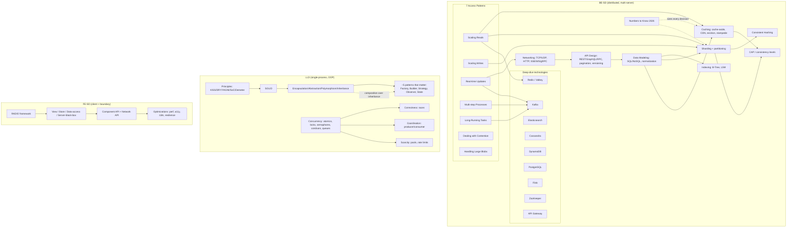
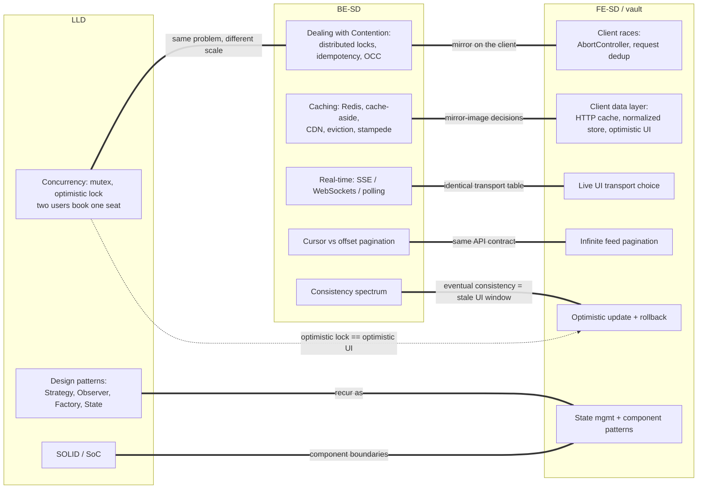

# Concept Map — System Design + LLD + Frontend

The master graph of the scraped knowledge base. Nodes are the load-bearing concepts; edges name the *relationship*, not just "related." Cross-domain edges (the ones that turn three separate study piles into one model) are called out explicitly in the second diagram and fully written up in [[01 - Cross-Domain Wiring]].

Three domains:

- **BE-SD** — backend system design (HelloInterview): distributed systems at multi-server scale.
- **LLD** — low-level design (HelloInterview): single-process OOP, design patterns, in-process concurrency.
- **FE-SD** — frontend system design (GreatFrontEnd): client architecture + the client↔server boundary, server treated as a black box.

The vault already owns FE-SD (module 29) and most of its supporting mechanisms (modules 08, 09, 13, 17, 19, 20, 21, 28). BE-SD and LLD are new territory ([[03 - Vault Integration Plan]]).

## Diagram 1 — Within-domain structure

## Diagram 2 — Cross-domain bridges (the high-value edges)

## How to read the edges

- `===` bold cross-domain edges are the ones worth memorizing; each is a place where knowing one side sharpens the other. All are written out with mechanism-and-divergence in [[01 - Cross-Domain Wiring]].
- `-.->` dotted edges are "sizes / constrains / motivates" relationships.
- The seven patterns (P1–P7) are the *connective tissue* of BE-SD: each one pulls specific KB concepts and specific technologies. They are the backend analog of RADIO's "O" deep-dives.

## Legend of node clusters

| Cluster | Where it lives now | Where it's going ([[03 - Vault Integration Plan]]) |
| --- | --- | --- |
| BE-SD KB + patterns + tech | `System Design/progress/hellointerview/` | new `30 - Backend System Design` |
| LLD principles/patterns/concurrency | `Low Level Design/progress/hellointerview/` | new `31 - Low Level Design` |
| FE-SD framework + case studies | `System Design/progress/greatfrontend/` | already in vault `29 - Frontend System Design` |

## Coverage note

Large portions of the HelloInterview patterns, deep dives, and Numbers-to-Know are **premium-locked in the scrapes** (only headings captured). The concept inventory ([[02 - Concept Inventory]]) marks every locked node so Phase B fills those gaps from primary sources rather than treating the scrape as complete. Locked nodes are still placed on this map because their *headings* tell us the shape of what's missing.
